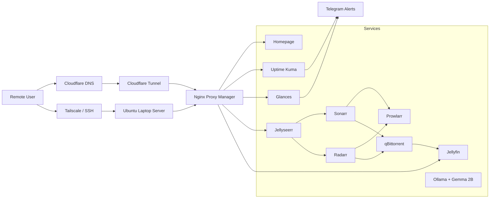

# ColossusBundi

ColossusBundi is a self-hosted personal cloud and automation platform built and operated by student engineer, pursuing undergrad at IIT DELHI. It started on an old Windows laptop during some free time over summers and gradually turned into a practical systems project for learning infrastructure design, remote operations, networking, service automation, and observability under real constraints.

The project is intentionally small and hands-on. The value is not in claiming scale; it is in showing the ability to take a machine from bare-metal installation to a remotely administered, monitored, service-hosting platform with repeatable configuration, persistent storage, and documented operational tradeoffs.

Key outcomes summarized:
- Self-hosted personal cloud
- Secure remote administration from anywhere
- Automated media delivery workflow
- Public service exposure despite CGNAT
- Monitoring and alerting
- Hands-on networking and infrastructure experience

## Overview

The platform combines three main concerns:

- infrastructure and remote access for a headless Ubuntu host
- service orchestration for a personal cloud and automation stack
- operational tooling for uptime visibility, alerting, and debugging

The host runs Docker Compose workloads for media-serving, request automation, dashboards, and monitoring. Remote administration is handled through SSH and Tailscale, while Cloudflare Tunnel is used to expose selected services publicly without direct port forwarding. Nginx Proxy Manager provides internal routing and simpler hostname management.

## Architecture

More detail is in [architecture/architecture.mmd](/Users/pranay/colossusbundi/architecture/architecture.mmd) and [docs/media-pipeline.md](/Users/pranay/colossusbundi/docs/media-pipeline.md).

## Key Features

- Headless Ubuntu server installation and recovery on consumer hardware
- Remote administration through SSH, Tailscale, and Cloudflare Tunnel
- Containerized service layout split by function: infrastructure, media, and monitoring
- Persistent data model using `/opt` for service config and `/mnt` for durable media/data
- Reverse proxy routing with private hostnames and public tunnel-backed exposure
- Monitoring with Uptime Kuma, Glances, Homepage, and Telegram alerts
- Troubleshooting records covering Wi-Fi setup, LVM expansion, WireGuard debugging, CGNAT, and Docker persistence

## Technology Stack

- OS and base system: Ubuntu Server, Linux, systemd, LVM
- Networking: SSH, Tailscale, WireGuard, Cloudflare DNS, Cloudflare Tunnel
- Reverse proxy and access: Nginx Proxy Manager
- Orchestration: Docker Compose
- Media and request automation: Jellyfin, Jellyseerr, Sonarr, Radarr, Prowlarr, qBittorrent
- Monitoring and operations: Homepage, Glances, Uptime Kuma, Telegram alerting
- Experiments: Ollama, Gemma 2B local inference

## Networking & Remote Access

One of the most useful parts of the project was learning how to operate a machine that was not always physically accessible. Initial setup required fixing Wi-Fi on a minimal Ubuntu installation, moving from temporary USB tethering to proper NetworkManager control, and handling a headless laptop that could not be allowed to suspend on lid close.

For private management, Tailscale became the most reliable path for SSH and day-to-day administration. WireGuard was tested directly as a way to understand the lower-level VPN workflow, including peer definitions, key handling, interface state, and handshake debugging. Public exposure ran into CGNAT constraints, so Cloudflare Tunnel became the practical answer for HTTPS-backed access without router port forwarding.

## Monitoring & Operations

The repository is designed to show operational ownership, not just service installation. Monitoring is split into service visibility, host visibility, and alerting:

- Uptime Kuma checks internal and public service availability
- Glances tracks host-level CPU, memory, load, and thermal behavior
- Homepage gives a single operational entrypoint for links and status
- Telegram alerting provides low-friction notifications for failures

This combination made it easier to catch basic failure modes such as containers not auto-starting after reboot, services breaking after storage refactors, and reverse proxy issues during hostname or DNS changes.

## Engineering Challenges & Lessons Learned

- CGNAT blocked straightforward inbound networking. The workaround was to stop fighting port forwarding and move public exposure to Cloudflare Tunnel.
- WireGuard debugging took multiple iterations. A misleading `SaveConfig=true` setting and bad key state caused configuration drift until the tunnel was rebuilt cleanly.
- Docker persistence was fragile early on because config and data paths were not separated clearly. Refactoring into `/opt` and `/mnt` made service rebuilds predictable.
- Reverse proxy setup was easy to get mostly working and harder to make consistent. Internal hostnames, DNS overrides, and service-specific assumptions all had to line up.
- Headless Linux administration on a laptop required dealing with lid-close behavior, display blanking, TTY-only operation, and the reality that a suspended machine cannot be recovered remotely.

These are covered in more detail in [docs/networking.md](/Users/pranay/colossusbundi/docs/networking.md), [docs/cloudflare-tunnel.md](/Users/pranay/colossusbundi/docs/cloudflare-tunnel.md), [docs/monitoring.md](/Users/pranay/colossusbundi/docs/monitoring.md), and [docs/lessons-learned.md](/Users/pranay/colossusbundi/docs/lessons-learned.md).

## Future Roadmap

- Add configuration backups and restore testing for `/opt` and Compose files
- Add cleaner secret management for tokens, API keys, and tunnel credentials
- Replace ad hoc local DNS experiments with a more durable internal naming approach
- Document recovery runbooks for host replacement or disk migration
- Expand monitoring with disk-usage alerts and container-level log shipping
- Keep local inference experiments isolated so they do not impact core platform stability

ColossusBundi is best read as a working lab notebook turned into an infrastructure portfolio repository: a small but real system that had to be installed, debugged, reorganized, exposed safely, and kept running.
