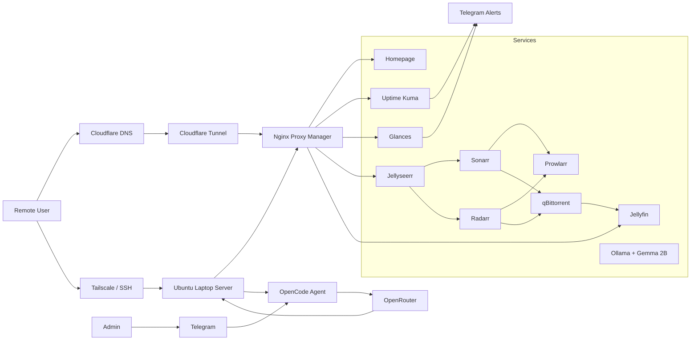

# ColossusBundi

ColossusBundi is my self-hosted personal cloud and home server setup. I'm an undergrad student at IIT Delhi, and I started this project during my summer break using an old Windows laptop I had lying around. What started as a fun way to pass the time turned into a hands-on project for learning Linux systems, networking, Docker, and monitoring under real constraints.

This isn't meant to be some massive enterprise-scale platform. I just wanted to see if I could take a raw laptop, install Ubuntu Server, and build a secure, remotely accessible media and automation setup that actually runs reliably.

### What it does:
- **My own media server:** Streams movies and shows automatically.
- **Remote access from anywhere:** I can SSH or access my services securely even when I'm away from home.
- **Bypasses CGNAT:** My ISP doesn't give me a public IP, but I found a way to host public services anyway.
- **Monitoring & Alerts:** Pings my Telegram if something goes down or if the laptop gets too hot.
- **AI Chatbot Ops:** I can trigger diagnostics and check server status using a Telegram bot powered by OpenCode CLI and OpenRouter.

---

## Overview

My setup does a few main things:
1. **Server & OS:** Runs headless Ubuntu Server on an old laptop.
2. **Services:** Docker Compose manages my containers (Jellyfin, Sonarr, Radarr, etc.).
3. **Networking:** SSH and Tailscale for private access, Cloudflare Tunnel for public access, and Nginx Proxy Manager for clean local URLs.
4. **AI Assistant:** OpenCode CLI is installed on the server and hooked up to a Telegram bot. If something breaks or if I want to run a quick diagnostic, I can chat with it on Telegram and it will look at my Docker logs or run safe commands.

---

## Architecture

More details can be found in the [architecture folder](architecture/) and the [docs](docs/) directory.

My AI-assisted operations path goes like this:
`Admin -> Telegram -> OpenCode Agent -> OpenRouter -> Ubuntu Server -> Infrastructure`

---

## How I Built It & Key Features

- **Headless Laptop Server:** Set up Ubuntu Server on an old laptop and made sure it doesn't suspend when the lid is closed.
- **Secure Remote Access:** Configured Tailscale so I can access the server securely from anywhere, plus a Cloudflare Tunnel for public URLs.
- **Docker Container Setup:** Organized everything into Docker Compose stacks: `infrastructure.yml`, `media-stack.yml`, and `monitoring.yml`.
- **Clean Storage Layout:** I learned the hard way to separate data and configs. Now, all service configs live in `/opt` and my actual media/downloads are on `/mnt`.
- **Local DNS & Reverse Proxy:** Set up Nginx Proxy Manager to map easy-to-remember domain names to different Docker ports.
- **Dashboard & Monitoring:** Uptime Kuma checks if services are running, Glances tracks system resources, and Telegram alerts ping my phone if something breaks.
- **Telegram AI Operator:** Set up a Telegram bot running OpenCode CLI and OpenRouter APIs so I can debug issues or check server health directly from my phone.

---

## Tech Stack

- **OS:** Ubuntu Server, systemd, LVM
- **Networking & VPN:** SSH, Tailscale, WireGuard, Cloudflare Tunnel, Cloudflare DNS
- **Reverse Proxy:** Nginx Proxy Manager
- **Containers:** Docker & Docker Compose
- **Media Stack:** Jellyfin, Jellyseerr, Sonarr, Radarr, Prowlarr, qBittorrent
- **Monitoring:** Homepage (dashboard), Glances, Uptime Kuma, Telegram Bot API
- **AI integration:** OpenCode CLI (via OpenRouter APIs), Ollama + Gemma 2B (for local AI tests)

---

## Networking & Remote Access

Operating a server you can't physically touch is a challenge. Right from the start, I had to fix the Wi-Fi on a minimal Ubuntu installation. Since the wireless packages weren't installed, I had to tether my Android phone via USB just to download NetworkManager and get the wireless card working. I also had to configure the system so the laptop wouldn't go to sleep when I closed the lid.

For day-to-day work, Tailscale has been a lifesaver. It lets me SSH into the server securely from my phone or main computer without opening ports. I also set up a raw WireGuard connection manually just to learn how VPN peers, handshakes, and public/private key routing work. 

To expose my media request page (Jellyseerr) to the web, I ran into carrier-grade NAT (CGNAT) because my home router doesn't get a public IP. I solved this by using a Cloudflare Tunnel, which forwards public HTTPS traffic to my local proxy without needing port forwarding at all.

---

## Monitoring & Operations

I wanted to make sure my server stays up, so I built a simple monitoring setup instead of manually checking things. Here's what I'm using:
- **Uptime Kuma:** Pings my local and public services to make sure they're actually responding.
- **Glances:** Keeps an eye on CPU, RAM, and temperature (which is super important on an old laptop).
- **Homepage:** A nice, clean dashboard that shows the status of all my services in one place.
- **Telegram Alerts:** Pings my phone if a service goes down or if the server reboots.

This setup saved me a bunch of times when my containers failed to start after a reboot, or when I messed up a DNS record while messing with the reverse proxy.

---

## AI-Assisted Operations

I also added an AI assistant to help me manage the server. I run OpenCode CLI on the laptop, which connects to OpenRouter. It's not a generic chatbot—it's customized to help me maintain this system.

Here's how I use it:
- It looks at my server status and docker logs to help diagnose problems.
- It can explain error logs in plain English and suggest fixes.
- It runs safe commands on the server if I approve them.
- I can talk to it directly through a private Telegram bot.

If I get a Telegram alert that a service is down while I'm in class, I can just ask the bot to check the logs and restart the container right from Telegram, without needing to open a full terminal or Tailscale connection.

---

## What I Learned & Things That Broke

- **Don't fight CGNAT:** I spent way too much time trying to configure port forwarding before realizing my ISP blocks incoming connections. Switched to Cloudflare Tunnel and it worked instantly.
- **Watch out for `SaveConfig=true` in WireGuard:** This setting kept overwriting my manual edits, which caused silent failures. I ended up wiping the setup and rebuilding the VPN configuration from scratch to fix it.
- **Structure your Docker volumes early:** I initially mixed configuration files and actual media downloads in random folders, which made updating containers a nightmare. Moving configurations to `/opt` and media to `/mnt` solved this.
- **Laptops are tricky servers:** I had to manually edit systemd configuration files to prevent the laptop from going to sleep when the lid was closed. If it goes to sleep, there's no way to wake it up remotely!

I wrote down detailed notes on how I fixed these issues in the docs:
- [Networking setup & issues](docs/networking.md)
- [Cloudflare Tunnel config](docs/cloudflare-tunnel.md)
- [Monitoring & alerting](docs/monitoring.md)
- [My full list of lessons learned](docs/learnings.md)

---

## What's Next?
- Set up automated backups for my `/opt` configs and docker-compose files.
- Move API keys and tokens out of plain text into a proper secrets manager.
- Set up disk-space alerts so the laptop drive doesn't fill up unexpectedly.
- Write a quick recovery guide in case the laptop hardware dies.
- Keep local AI tests (like Ollama) isolated so they don't crash my media server.

This project is basically my digital playground and lab notebook. It's a small system, but keeping it running, secure, and properly monitored has taught me more about real-world systems than any textbook.
