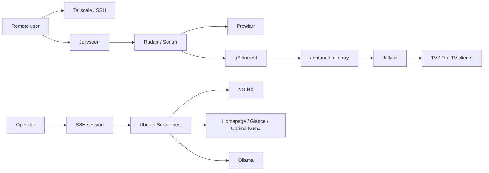

# Stack Overview

This project runs a self-hosted media and access stack on a single Ubuntu Server machine built from an old Ryzen laptop. The design favors simple, inspectable components over heavy orchestration.

## Design Goals

- Keep the deployment understandable by one person operating remotely over SSH
- Use Docker Compose instead of introducing Kubernetes prematurely
- Separate service state from media data so rebuilds are survivable
- Support remote administration even when the server has no local monitor workflow
- Make the media flow mostly automatic after the initial request

## Service Groups

### Media stack
- `Jellyseerr`: request intake
- `Radarr`: movie automation
- `Sonarr`: TV automation
- `Prowlarr`: indexer aggregation
- `qBittorrent`: download client
- `Jellyfin`: playback and library serving

### Networking and access
- `Tailscale`: reliable private remote access and SSH
- `NGINX`: local reverse proxy for human-friendly service URLs
- `WireGuard`: self-managed VPN experiment; useful learning, but more operational friction than Tailscale
- `Cloudflare Tunnel`: planned option for remote publishing without opening inbound ports

### Monitoring and dashboarding
- `Homepage`
- `Glance`
- `Uptime Kuma`

### AI experiments
- `Ollama`

## Layout Decisions

The most important storage lesson in this project was moving away from ad hoc app directories and toward clearer boundaries:

- `/opt`: service configs and application state
- `/mnt`: media and other persistent data

That split came from a failure mode: earlier container removal also removed important config and persistent state, which made service recovery slower than necessary. After refactoring, the compose file became a blueprint and the state layout became much more predictable.

## Network Model

## What Is And Isn’t In Git Yet

Current public repo state:

- docs and structure are present
- sanitized compose manifests are not yet committed
- sanitized reverse proxy and tunnel configs are not yet committed

That is a documentation gap, not an architecture gap. The docs in this repository reflect the actual system that was built and debugged, but the final step of exporting safe public config examples is still pending.

## Operational Constraints

- The host is consumer hardware, not rack hardware.
- Inbound connectivity is limited by ISP/CGNAT realities.
- The machine needed to stay operational headlessly, including with lid-close and display-power workarounds.
- Thermal limits matter for local inference workloads.

## Why Docker Compose Was The Right Fit

For this project stage, Docker Compose is a better fit than a more complex orchestrator:

- single-node deployment
- easy to inspect remotely
- low operational overhead
- realistic for a fast-moving personal infrastructure build

This keeps the focus on Linux, networking, service integration, persistence, and debugging instead of spending the project budget on orchestration complexity.
